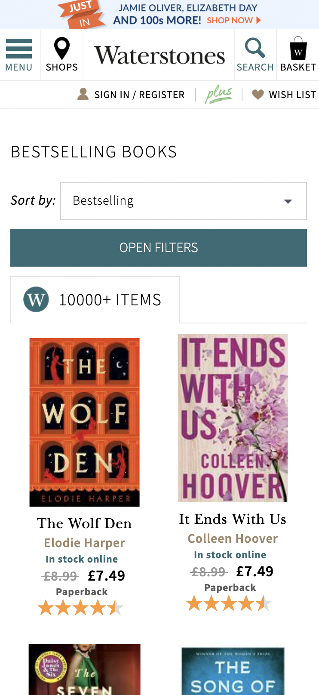
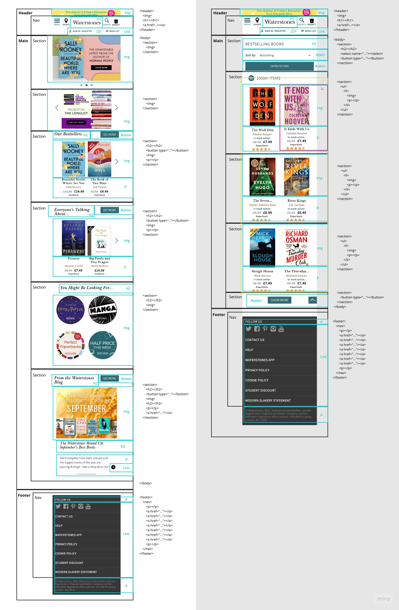
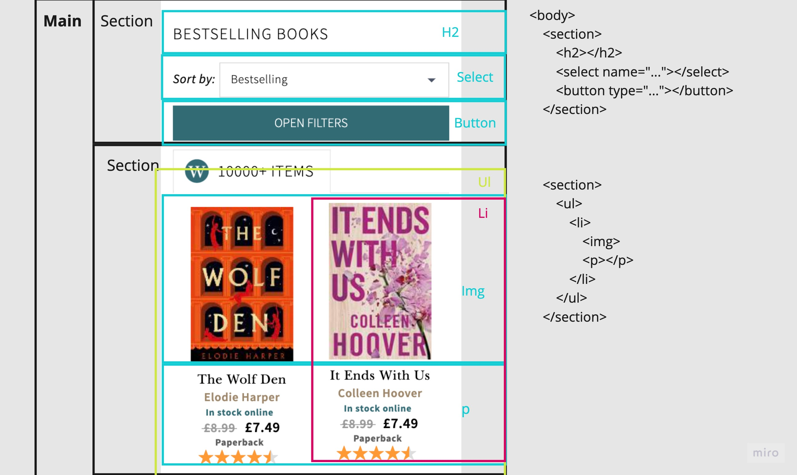

# Procesverslag
Markdown is een simpele manier om HTML te schrijven.  
Markdown cheat cheet: [Hulp bij het schrijven van Markdown](https://github.com/adam-p/markdown-here/wiki/Markdown-Cheatsheet).

Nb. De standaardstructuur en de spartaanse opmaak van de README.md zijn helemaal prima. Het gaat om de inhoud van je procesverslag. Besteedt de tijd voor pracht en praal aan je website.

Nb. Door *open* toe te voegen aan een *details* element kun je deze standaard open zetten. Fijn om dat steeds voor de relevante stuk(ken) te doen.

## Jij

uitwerken voor kick-off werkgroep

### Auteur:
Noa Kaylee Beke

#### Je startniveau:
Blauwe piste

#### Je focus:
Surface plane
 

## Je website

uitwerken voor kick-off werkgroep

### Je opdracht:
https://www.waterstones.com

#### Screenshot(s) van de eerste pagina (small screen): 
Bestsellers

#### Screenshot(s) van de tweede pagina (small screen):
Homepagina

 

## Breakdownschets (week 1)

uitwerken na afloop 2e werkgroep

### de hele pagina: 

### dynamisch deel (bijv menu): 

## Voortgang 1 (week 2)

uitwerken voor 1e voortgang

### Stand van zaken
Ik heb voor deze voortgang alleen de html van de eerste pagina gemaakt. Dit was redelijk makkelijk aangezien het grootste deel van de site
tot leven komt in de css.

### Verslag van meeting
Aangezien ik alleen nog html had was er geen feedback.

## Voortgang 2 (week 3)

uitwerken voor 2e voortgang

### Stand van zaken
Ik had deze week al grotendeels van mijn eerste pagina af. In eerste instantie gebruikte ik veel classes en div en kwam er later pas achter dat je ook :nth-of-type kon gebruiken. 
Dit was voor mij best wel omschakelen omdat ik het nog nooit gebruiky had en niet echt wist wat het inhield. Na een paar keer het te hebben gebruikt begreep ik het wel.

### Verslag van meeting
Ik kreeg de feedback om comments te gebruiken in mijn css en html voor meer overzicht.

## Toegankelijkheidstest (week 4)

uitwerken na test in 8e voortgang

### Bevindingen
Lijst met je bevindingen die in de test naar voren kwamen:

#### Titel eerste bevinding
Mijn afbeeldingen hebben nog geen labels waardoor de screenreader het voorleest als "ongelabelde afbeelding".

#### Titel tweede bevinding. 
Tijdens het tabben kwam ik er achter dat grotendeels van mijn website niet tabbaar is. 

## Voortgang 3 (week 4)

uitwerken voor 3e voortgang

### Stand van zaken
Ik had deze week mijn slideshow in javascript gemaakt en mijn animatie (hamburgermenu) met css. De slideshow die ik had gemaakt kwam van een code die ik 
van google had. Deze code begreep ik niet zo goed en had al opgezocht hoe deze eventueel werkte.

### Verslag van meeting
Ik kreeg de feedback om te kijken naar mijn javascript omdat ik dat niet begreep (eventueel veranderen naar iets simpelers). Verder stonden er nog spaties 
in mijn foto's en die moest ik weghalen. Ook kreeg ik weer te horen dat ik comments moest neerzetten in mijn html en css. Omdat de website die ik 
naamaak volledig in het engels is moest ik oo nog mijn html taal op engels zetten.

## Eindgesprek (week 5)

uitwerken voor eindgesprek

### Stand van zaken
hier dit ging goed & dit was lastig (neem ook screenshots op van delen van je website en code)

### Screenshot(s)

hier screenshot(s) van je eindresultaat

## Bronnenlijst

continu bijhouden terwijl je werkt

Nb. Wees specifiek ('css-tricks' als bron is bijv. niet specifiek genoeg).

1. bron 1
2. bron 2
3. ...

